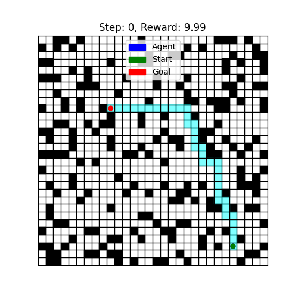
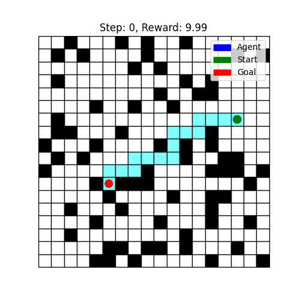

# MyCustomGrid Environment

A customized grid environment, based on [gym-simplegrid](https://github.com/damat-le/gym-simplegrid), for reinforcement learning featuring obstacles, path planning, and goal-seeking behavior.

## Examples

  
  

In these examples, the blue circle represents the agent, the red circle is the goal, and the cyan path shows the optimal route calculated by the D* Lite algorithm. Black squares indicate obstacles that the agent must navigate around.
